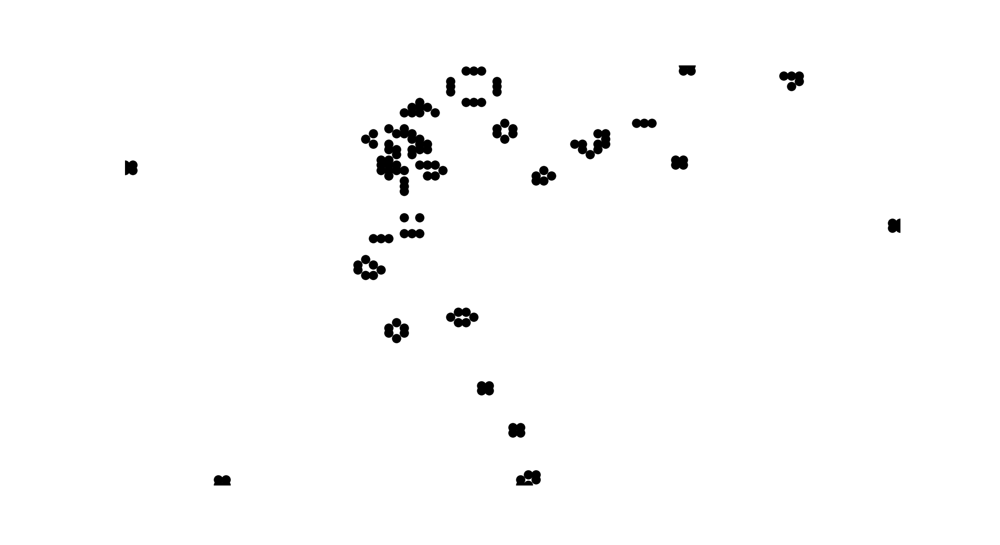

# Conway's Game Of Life

Simple implementation of Conway's Game Of Life, it can take a given state to start, or randomize the board with a given density.

The program is implemented using a minimum size array, keeping only a record of the alive cells, hence saving memory and processing time each iteration. The other alternative is to keep a full array of the board and specify 0 or 1 if the cell is dead or alive.

